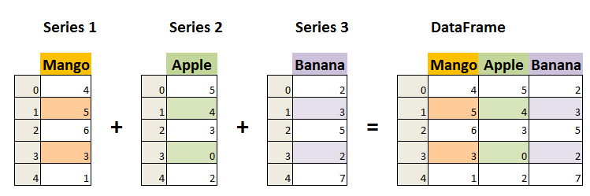

# Pandas数据结构-Series

Pandas Series 类似表格中的一个列（column），类似于一维数组，可以保存任何数据类型。

Series 由索引（index）和列组成，函数如下：

```python
pandas.Series( data, index, dtype, name, copy)
```

参数说明：

- **data**：一组数据(ndarray 类型)。

- **index**：数据索引标签，如果不指定，默认从 0 开始。

- **dtype**：数据类型，默认会自己判断。

- **name**：设置名称。

- **copy**：拷贝数据，默认为 False。

  ```python
  import pandas as pd
  
  a = [1, 2, 3]
  
  myvar = pd.Series(a)
  
  print(myvar)
  ```

  ```python
  0    1
  1    2
  2    3
  dtype: int64
  ```

  

从上图可知，如果没有指定索引，索引值就从 0 开始，我们可以根据索引值读取数据：

```python
import pandas as pd

a = [1, 2, 3]

myvar = pd.Series(a)

print(myvar[1])
```

```python
2
```

我们可以指定索引值，如下实例：

```python
import pandas as pd

a = ["Google", "Runoob", "Wiki"]

myvar = pd.Series(a, index = ["x", "y", "z"])

print(myvar)
```

```python
x    Google
y    Runoob
z      Wiki
dtype: object
```

根据索引值读取数据:

```python
import pandas as pd

a = ["Google", "Runoob", "Wiki"]

myvar = pd.Series(a, index = ["x", "y", "z"])

print(myvar["y"])
```

```python
Runoob
```

我们也可以使用 key/value 对象，类似字典来创建 Series：

```python
import pandas as pd

sites = {1: "Google", 2: "Runoob", 3: "Wiki"}

myvar = pd.Series(sites)

print(myvar)
```

```python
1    Google
2    Runoob
3      Wiki
dtype: object
```

从上图可知，字典的 key 变成了索引值。

如果我们只需要字典中的一部分数据，只需要指定需要数据的索引即可，如下实例：

```python
import pandas as pd

sites = {1: "Google", 2: "Runoob", 3: "Wiki"}

myvar = pd.Series(sites, index = [1, 2])

print(myvar)
```

```python
1    Google
2    Runoob
dtype: object
```

设置 Series 名称参数：

```python
import pandas as pd

sites = {1: "Google", 2: "Runoob", 3: "Wiki"}

myvar = pd.Series(sites, index = [1, 2], name="RUNOOB-Series-TEST" )

print(myvar)
```

```python
1    Google
2    Runoob
Name: RUNOOB-Series-TEST, dtype: object
```

# Pandas数据结构-DataFrame

DataFrame 是一个表格型的数据结构，它含有一组有序的列，每列可以是不同的值类型（数值、字符串、布尔型值）。DataFrame 既有行索引也有列索引，它可以被看做由 Series 组成的字典（共同用一个索引）。




DataFrame 构造方法如下：

```python
pandas.DataFrame( data, index, columns, dtype, copy)
```

参数说明：

- **data**：一组数据(ndarray、series, map, lists, dict 等类型)。

- **index**：索引值，或者可以称为行标签。

- **columns**：列标签，默认为 RangeIndex (0, 1, 2, …, n) 。

- **dtype**：数据类型。

- **copy**：拷贝数据，默认为 False。

  

Pandas DataFrame 是一个二维的数组结构，类似二维数组。

```python
import pandas as pd

data = [['Google',10],['Runoob',12],['Wiki',13]]

df = pd.DataFrame(data,columns=['Site','Age'],dtype=float)

print(df)
```

```python
     Site   Age
0  Google  10.0
1  Runoob  12.0
2    Wiki  13.0
```

以下实例使用 ndarrays 创建，ndarray 的长度必须相同， 如果传递了 index，则索引的长度应等于数组的长度。如果没有传递索引，则默认情况下，索引将是range(n)，其中n是数组长度。

```python
import pandas as pd

data = {'Site':['Google', 'Runoob', 'Wiki'], 'Age':[10, 12, 13]}

df = pd.DataFrame(data)

print (df)
```

```python
     Site  Age
0  Google   10
1  Runoob   12
2    Wiki   13
```

从以上输出结果可以知道， DataFrame 数据类型一个表格，包含 rows（行） 和 columns（列）：


还可以使用字典（key/value），其中字典的 key 为列名:

```python
import pandas as pd

data = [{'a': 1, 'b': 2},{'a': 5, 'b': 10, 'c': 20}]

df = pd.DataFrame(data)

print (df)
```

```python
   a   b     c
0  1   2   NaN
1  5  10  20.0
```

没有对应的部分数据为 **NaN**。

Pandas 可以使用 **loc** 属性返回指定行的数据，如果没有设置索引，第一行索引为 **0**，第二行索引为 **1**，以此类推：

```python
import pandas as pd

data = {
  "calories": [420, 380, 390],
  "duration": [50, 40, 45]
}

# 数据载入到 DataFrame 对象
df = pd.DataFrame(data)

# 返回第一行
print(df.loc[0])
# 返回第二行
print(df.loc[1])
```

```python
calories    420
duration     50
Name: 0, dtype: int64
calories    380
duration     40
Name: 1, dtype: int64
```

**注意：**返回结果其实就是一个 Pandas Series 数据。

也可以返回多行数据，使用 **[[ ... ]]** 格式，**...** 为各行的索引，以逗号隔开：

```python
import pandas as pd

data = {
  "calories": [420, 380, 390],
  "duration": [50, 40, 45]
}

# 数据载入到 DataFrame 对象
df = pd.DataFrame(data)

# 返回第一行和第二行
print(df.loc[[0, 1]])
```

```python
   calories  duration
0       420        50
1       380        40
```

**注意：**返回结果其实就是一个 Pandas DataFrame 数据。

我们可以指定索引值，如下实例：

```python
import pandas as pd

data = {
  "calories": [420, 380, 390],
  "duration": [50, 40, 45]
}

df = pd.DataFrame(data, index = ["day1", "day2", "day3"])

print(df)
```

```python
      calories  duration
day1       420        50
day2       380        40
day3       390        45
```

Pandas 可以使用 **loc** 属性返回指定索引对应到某一行：

```python
import pandas as pd

data = {
  "calories": [420, 380, 390],
  "duration": [50, 40, 45]
}

df = pd.DataFrame(data, index = ["day1", "day2", "day3"])

# 指定索引
print(df.loc["day2"])
```

```python
calories    380
duration     40
Name: day2, dtype: int64
```

